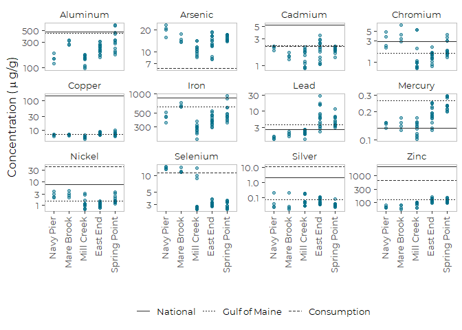
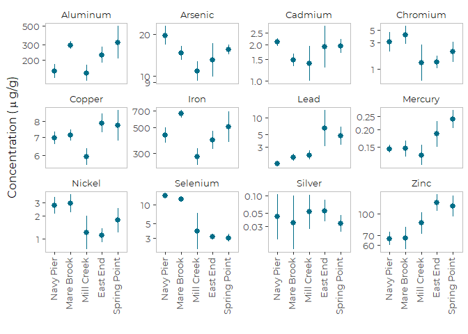
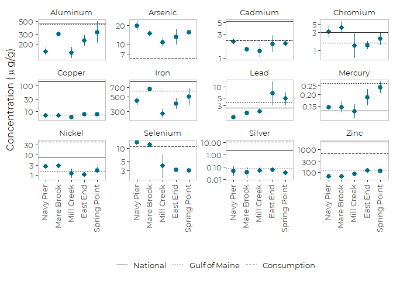
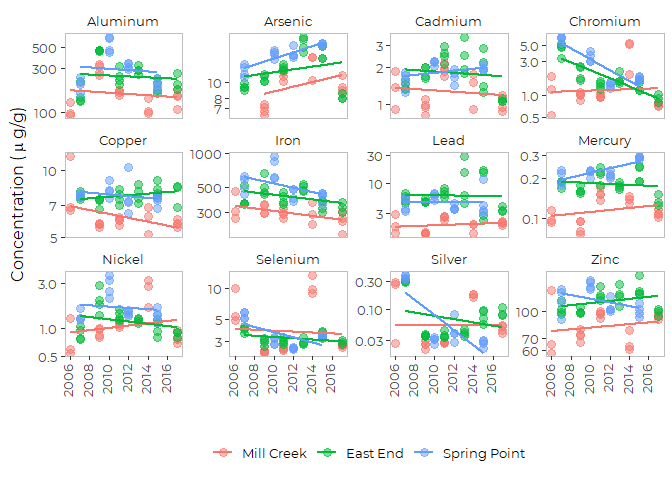

Analysis of Metal Contaminants from EGAD Mussel Toxics Data
================
Curtis C. Bohlen, Casco Bay Estuary Partnership
11/10/2020

  - [Introduction](#introduction)
      - [Handling Non-Detects](#handling-non-detects)
  - [Load Libraries](#load-libraries)
  - [Load Data](#load-data)
      - [Establish Folder Reference](#establish-folder-reference)
      - [Utility Function](#utility-function)
      - [Copy Data](#copy-data)
      - [Load Reference Values](#load-reference-values)
      - [Load Location Information](#load-location-information)
  - [Evaluating Non-detects](#evaluating-non-detects)
  - [Distribution of Samples in Space and
    Time](#distribution-of-samples-in-space-and-time)
  - [Data since 2010](#data-since-2010)
      - [Preliminary Graphic](#preliminary-graphic)
      - [Means and Standard Errors](#means-and-standard-errors)
  - [Trend Analyses](#trend-analyses)
      - [Graphic](#graphic)
      - [Simple Linear Model](#simple-linear-model)
      - [Robust Regression](#robust-regression)
      - [Stepwise Model Selection](#stepwise-model-selection)
      - [Results](#results)
      - [Results Table](#results-table)
      - [Summary Table](#summary-table)


# Introduction

Maine’s Department of Environmental Protection (DEP) maintains a large
database of environmental data called “EGAD”. Citizens can request data
from the database through DEP staff.

CBEP requested data from DEP on levels of toxic contaminants in
shellfish tissue samples from Casco Bay. The result is a large (\>
100,000 line) excel spreadsheet containing data from about 40 sampling
dates from 20 locations, over a period of more than 15 years.

In this Notebook, we analyze metal contaminants found in blue mussel
(*Mytilus edulis*) tissue. To simplify presentation, we focus on two
questions: Do recent samples exceed screening values, and do any metals
show a trend in levels?

DEP staff pointed us towards the detailed documentation in the 2017-2018
SWAT data report.

> Maine Department of Environmental Protection. 2019. Surface Water
> Ambient Toxics Monitoring Program. 2017-2018 Report to the Joint
> Committee on Environmental and Natural Resources. 129th Legislature,
> First Session.

Much of the following analysis is based on that information.

## Handling Non-Detects

A “Non-Detect” is a sample where the concentration of a specific
contaminant is below the level where the laboratory methods are able to
reliably detect the contaminant against background interference,
measurement error, and instrument limitations. Statistically, a
“non-detect” is a “left censored” observation. We know the observation
falls below the reporting limit, but we don’t know by how much.

Leaving non-detects out of analyses entirely biases results, because the
lowest observations (the non-detects) are omitted from analysis. So it
is generally necessary to adopt statistical methods or some other
convention for handling non-detects.

While more sophisticated modeling approaches are available, CBEP’s
preference for addressing non-detects is to replace non-detects before
conducting analyses with an alternate value. The question then becomes,
what value should be used to replace the (unobserved) non-detect?

CBEP’s preference is to use (statistically-based) estimates of what one
would expect to have observed, if laboratory methods were better.
Specifically, for the 2020 State of Casco Bay Report, CBEP prefers to
replace non-detects with maximum likelihood estimates of the expected
value of the (unobserved) censored observations.

However, we have not done that for these analyses. We prefer to treat
non-detects from any single data source consistently, and we could not
use our preferred convention for addressing non-detects for organic
contaminants from the SWAT data. Because of differences in reporting of
PAHs from year to year, we were unable to recalculate PAH totals from
the raw observations, and instead have relied on calculations conducted
by Maine DEP. DEP provides results using three different conventions:
replace non-detects with, respectively, zero, half the reporting limit,
or the reporting limit.

Here, we follow their convention of conducting analyses based on
replacing non-detects with one half of the Reporting Limit.

For metals in these samples, non-detects are relatively rare, and
detection limits are well below observed levels, so choice of the
non-detect convention should have little effect on the qualitative
results of these analyses.

# Load Libraries

``` r
library(tidyverse)
```

    ## -- Attaching packages -------------------------------------------------------------------------------------- tidyverse 1.3.0 --

    ## v ggplot2 3.3.2     v purrr   0.3.4
    ## v tibble  3.0.3     v dplyr   1.0.2
    ## v tidyr   1.1.2     v stringr 1.4.0
    ## v readr   1.3.1     v forcats 0.5.0

    ## -- Conflicts ----------------------------------------------------------------------------------------- tidyverse_conflicts() --
    ## x dplyr::filter() masks stats::filter()
    ## x dplyr::lag()    masks stats::lag()

``` r
library(readxl)
library(htmltools)  # used by knitr called here only to avoid startup text later in document
library(knitr)      # knitr's namespace is already available, so loading it with
                    # 'library()' only avoids start-up issues when we call
                    # knitr::kable() later.

library(mblm)
library(emmeans)

library(CBEPgraphics)
load_cbep_fonts()
theme_set(theme_cbep())

library(LCensMeans)
```

# Load Data

## Establish Folder Reference

``` r
sibfldnm <- 'Derived_Data'
parent   <- dirname(getwd())
sibling  <- file.path(parent,sibfldnm)
fn <- 'SWAT_metals_working.csv'

#dir.create(file.path(getwd(), 'figures'), showWarnings = FALSE)
```

## Utility Function

This splits a string, capitalizes the first character, uncapitalizes the
rest. For one word strings, this returns them capitalized.

``` r
simpleCap <- function(x) {
  s <- strsplit(x, " ")[[1]]
  paste(toupper(substring(s, 1,1)), tolower(substring(s, 2)),
      sep="", collapse=" ")
}

convert_caps <- function(x_vec) {
  as_vector(lapply(x_vec, simpleCap))
}
```

## Copy Data

Getting the column types right improves load speed. Much of the data is
qualitative, and can’t be readily handled in R, so we delete it. To save
on keystrokes, we also clean up the parameter names.

``` r
swat_metals <- read_csv(file.path(sibling, fn),
                        col_types = cols(
                          .default = col_character(),
                          site_seq = col_double(),
                          year = col_double(),
                          sample_date = col_date(format = ""),
                          concentration = col_double(),
                          rl = col_double(),
                          mdl = col_double(),
                          dilution_factor = col_double(),
                          cas_no = col_double(),
                          conc_ugg = col_double(),
                          rl_ugg = col_double(),
                          flag = col_logical(),
                          conc_RL = col_double(),
                          conc_HALF = col_double(),
                          conc_ML = col_double()
                        )) %>%
  select(-site_seq, -lab, -method, -method_name,
         -prep_method, -dilution_factor, -cas_no) %>%
  mutate(parameter = convert_caps(parameter))
```

``` r
unique(swat_metals$parameter)
```

    ##  [1] "Arsenic"  "Cadmium"  "Lead"     "Selenium" "Zinc"     "Chromium"
    ##  [7] "Aluminum" "Copper"   "Iron"     "Silver"   "Mercury"  "Nickel"

## Load Reference Values

There are few really good ways to establish toxicity benchmarks for
edible tissue. Maine DEP principally compares values of analytic totals
to prevalence benchmarks (medians and 85th percentiles) derived from the
Gulfwatch and National Status And trends monitoring programs, as
published by Leblanc et al. 2009.

> Leblanc, L.A., Krahforst, C.F., Aubé, J., Roach, S., Brun, G.,
> Harding, G., Hennigar, P., Page, D., Jones, S., Shaw, S., Stahlnecker,
> J., Schwartz, J., Taylor, D., Thorpe, B., & Wells, P. (2009).
> Eighteenth Year of the Gulf of Maine Environmental Monitoring Program.

We copied benchmark tables from (an on-line version of) Leblanc et
al. 2009 into our excel spreadsheet.

In addition, DEP reports on a number of health thresholds, based on
“FTALs” – MCDC Fish Tissue Action Levels. They are not tabulated in
the report.

After some digging on-line, we found a document that corresponds to the
FTALs reported by DEP. we copied those values by hand onto the Excel
spreadsheet, and reorganized the spreadsheet

> Maine Center for Disease Control. 2001. Bureau of Health Fish Tissue
> Action Levels.
> <https://www.maine.gov/dhhs/mecdc/environmental-health/eohp/fish/documents/action-levels-writeup.pdf>.
> Accessed 11/10/2020.

``` r
references <- read_excel(file.path(sibling,"Parameter List.xlsx"), 
                             sheet = "Metals Comparisons") %>%
  filter(! is.na(Reference_ugg)) %>%
  mutate(Reference_ugg = sub(' 2008', '', Reference_ugg))
```

``` r
unique(references$Reference_ugg)
```

    ##  [1] "NS&T Medians"                      "NS&T 85th Percentile"             
    ##  [3] "Gulfwatch Medians"                 "Gulfwatch 85th Percentile"        
    ##  [5] "Cancer FTAL ug/g"                  "Non-Cancer FTAL ug/g"             
    ##  [7] "FDA Action Level"                  "Outdated FTAL"                    
    ##  [9] "Methyl Mercury FTAL Developmental" "Methyl Mercury FTAL Adult"        
    ## [11] "Chromium VI Cancer FTAL"           "Chromium VI Non-Cancer FTAL"

### Pivot Longer for Important References

``` r
ref_long <- references %>%
  filter(grepl('85', Reference_ugg) |
           Reference_ugg == "Non-Cancer FTAL ug/g") %>%
  mutate(short_ref = factor(Reference_ugg,
                            levels = c('NS&T 85th Percentile',
                                       'Gulfwatch 85th Percentile',
                                       "Non-Cancer FTAL ug/g"),
                            labels = c('National',
                                       'Gulf of Maine',
                                       "Consumption"))) %>%
  pivot_longer(cols = Silver:Zinc, names_to = 'parameter', values_to = 'value')
```

## Load Location Information

And add a short location name for figures.

``` r
locations <- read_csv(file.path(sibling,"sites_spatial.csv"), 
    col_types = cols(SITESEQ = col_skip(), 
        LAT = col_skip(), LONG = col_skip())) %>%

  mutate(short_locs= c("Back Bay",
                      "Outer Fore River",
                      "Cocktail Cove",
                      "SW Great Diamond",
                      "Navy Pier",
                      "Mill Creek",
                      "Royal River",
                      "Haraseeket",
                      "Falmouth",
                      "Mare Brook",
                      "Fore River",
                      "East End",
                      "Spring Point",
                      "Jewel Island",
                      "Presumpscot",
                      "Middle Bay",
                      "Maquoit Bay",
                      "Inner Fore",
                      "Quahog Bay",
                      "Long Island"))
  

swat_metals <- swat_metals %>%
  mutate(short_locs = locations$short_locs[match(sitecode,
                                                 locations$SITECODE)]) %>%
  mutate(short_locs = factor(short_locs,
                             levels = c('Navy Pier', 'Mare Brook', 'Mill Creek',
                                        'East End', 'Spring Point')))
rm(locations)
```

# Evaluating Non-detects

``` r
xtabs(~ parameter + lab_qualifier , data = swat_metals, addNA = TRUE)
```

    ##           lab_qualifier
    ## parameter    B  BL   J   U <NA>
    ##   Aluminum   0  24  11   0   80
    ##   Arsenic    0   0   0   0  106
    ##   Cadmium    0   0   0   0  115
    ##   Chromium   2   0   0   1  112
    ##   Copper     0   0   0   0  115
    ##   Iron       0  11   0   0  104
    ##   Lead       0   0   0   0  115
    ##   Mercury    0   0   0   0  115
    ##   Nickel    34   0   0   5   76
    ##   Selenium   0  16   0   0   99
    ##   Silver     8   4   6  42   55
    ##   Zinc       0  12   0   0  103

Non-detects are signified with a `lab_qualifier` of“U”, so the only
metal for which non-detects are important is Silver.

``` r
xtabs(~ lab_qualifier + year, data = swat_metals, addNA = TRUE,
      subset = parameter == 'Silver')
```

    ##              year
    ## lab_qualifier 2006 2007 2008 2009 2010 2011 2012 2013 2014 2015 2017
    ##          B       6    0    2    0    0    0    0    0    0    0    0
    ##          BL      0    0    0    0    0    0    4    0    0    0    0
    ##          J       0    0    0    0    0    0    0    0    6    0    0
    ##          U       3   28    6    0    0    0    0    0    5    0    0
    ##          <NA>    0    0    0   24    4    8    0    4    0    8    7

What that shows is the bulk of the non-detects are from the early years.

``` r
xtabs(~ lab_qualifier + sitecode, data = swat_metals, addNA = TRUE,
      subset = parameter == 'Silver' )
```

    ##              sitecode
    ## lab_qualifier CBANAN CBBBBB CBEEEE CBFRIR CBFRMR CBGDCC CBHRHR CBHWNP CBJWPB
    ##          B         0      3      0      0      0      1      0      0      0
    ##          BL        0      0      0      0      0      0      0      0      0
    ##          J         0      0      0      0      0      0      0      3      0
    ##          U         4      0      4      0      4      2      4      1      4
    ##          <NA>      0      0     19      4      0      0      0      0      0
    ##              sitecode
    ## lab_qualifier CBLNFT CBMBBH CBMBBR CBMBMB CBMCMC CBPRMT CBQHQH CBSPSP
    ##          B         0      0      0      2      2      0      0      0
    ##          BL        0      0      0      0      0      0      0      4
    ##          J         0      3      0      0      0      0      0      0
    ##          U         0      5      0      2      4      4      0      4
    ##          <NA>      4      0      4      0     12      0      4      8

and non-detects from the trend sites (‘CBEEEE’, ‘CBMCMC’, and ‘CBSPSP’)
are \~ 30 percent of observations. Most non-detects were for sites
sampled in 2007 and not sampled since. We can keep Silver in the
analyses, but need to be careful about interpreting results of
quantitative analyses, especially as reporting limits vary by an order
of magnitude.

``` r
swat_metals %>%
  filter(parameter == 'Silver') %>%
  filter(lab_qualifier == "U") %>%
  select(rl) %>%
  summary
```

    ##        rl         
    ##  Min.   :0.05305  
    ##  1st Qu.:0.53914  
    ##  Median :0.58952  
    ##  Mean   :0.56063  
    ##  3rd Qu.:0.68584  
    ##  Max.   :0.81000

# Distribution of Samples in Space and Time

``` r
xtabs(~ sitecode + year , data = swat_metals,
      subset = parameter == 'Cadmium')
```

    ##         year
    ## sitecode 2006 2007 2008 2009 2010 2011 2012 2013 2014 2015 2017
    ##   CBANAN    0    4    0    0    0    0    0    0    0    0    0
    ##   CBBBBB    3    0    0    0    0    0    0    0    0    0    0
    ##   CBEEEE    0    4    0    4    0    4    0    4    0    4    3
    ##   CBFRIR    0    0    0    4    0    0    0    0    0    0    0
    ##   CBFRMR    0    4    0    0    0    0    0    0    0    0    0
    ##   CBGDCC    3    0    0    0    0    0    0    0    0    0    0
    ##   CBHRHR    0    4    0    0    0    0    0    0    0    0    0
    ##   CBHWNP    0    0    0    0    0    0    0    0    4    0    0
    ##   CBJWPB    0    4    0    0    0    0    0    0    0    0    0
    ##   CBLNFT    0    0    0    4    0    0    0    0    0    0    0
    ##   CBMBBH    0    4    0    0    0    0    0    0    4    0    0
    ##   CBMBBR    0    0    0    4    0    0    0    0    0    0    0
    ##   CBMBMB    0    0    4    0    0    0    0    0    0    0    0
    ##   CBMCMC    3    0    0    4    0    4    0    0    3    0    4
    ##   CBPRMT    0    0    4    0    0    0    0    0    0    0    0
    ##   CBQHQH    0    0    0    4    0    0    0    0    0    0    0
    ##   CBSPSP    0    4    0    0    4    0    4    0    0    4    0

We have few sites with good temporal coverage. Most sites were only
sampled once. The high frequency sites (three or more sample years)
include: \* CBEEEE – \* CBMCMC \* CBSPSP

In addition, CBMBBH was sampled twice. Other sites were each sampled
only once, making them problematic for trend analysis, since sites are
NOT random samples drawn from a well defined population of sites.

We have only two years, and three sites (our three high frequency sites)
sampled since our last State of the Bay report, to offer a recent
“status” update. If we extend to the last ten years, we only pick up
only two more, both sampled in 2014.

Certain years, notably 2007 and 2009 have relatively dense spatial
coverage, however, both are from before our current ten year period.

``` r
xtabs(~ parameter + year , data = swat_metals)
```

    ##           year
    ## parameter  2006 2007 2008 2009 2010 2011 2012 2013 2014 2015 2017
    ##   Aluminum    9   28    8   24    4    8    4    4   11    8    7
    ##   Arsenic     0   28    8   24    4    8    4    4   11    8    7
    ##   Cadmium     9   28    8   24    4    8    4    4   11    8    7
    ##   Chromium    9   28    8   24    4    8    4    4   11    8    7
    ##   Copper      9   28    8   24    4    8    4    4   11    8    7
    ##   Iron        9   28    8   24    4    8    4    4   11    8    7
    ##   Lead        9   28    8   24    4    8    4    4   11    8    7
    ##   Mercury     9   28    8   24    4    8    4    4   11    8    7
    ##   Nickel      9   28    8   24    4    8    4    4   11    8    7
    ##   Selenium    9   28    8   24    4    8    4    4   11    8    7
    ##   Silver      9   28    8   24    4    8    4    4   11    8    7
    ##   Zinc        9   28    8   24    4    8    4    4   11    8    7

So almost all metals are available from all time periods.

# Data since 2010

Give the paucity of data and sited from 2015 through 2019, we consider
“recent” data to include the last 10 years, or 2010 through 2019.

``` r
recent_data <- swat_metals %>%
  filter(year >= 2010)
```

## Preliminary Graphic

``` r
plt <- ggplot(recent_data,
              aes(short_locs, conc_HALF)) +
  geom_point(color = cbep_colors()[1], alpha = 0.5) +
  
  scale_y_log10() +
  theme_cbep(base_size = 12) +
  theme(legend.title = element_blank()) +
  
  
  facet_wrap(~parameter, scale="free_y") +
  ylab(expression("Concentration (" ~ mu ~ "g/g)")) +
  xlab('') +
  theme(axis.text.x = element_text(angle = 90, vjust = 0.25, hjust = 1)) +
  theme(legend.position = 'bottom',
        panel.border = element_rect(color = 'gray', fill = NA, size = 0.25))
plt
```

<!-- -->

``` r
plt +
  geom_hline(mapping = aes(yintercept = value,
                 lty = short_ref),
             color = cbep_colors2()[1],
             data = ref_long )
```

    ## Warning: Removed 10 rows containing missing values (geom_hline).

<!-- -->

``` r
 #ggsave('figures/metals_parameters.pdf', device = cairo_pdf, width = 7, height = 5)
```

## Means and Standard Errors

``` r
plt <- recent_data %>%
  ggplot(aes(short_locs, conc_ML)) +
  stat_summary(fun.data=mean_sdl, fun.args = list(mult=1), 
        geom="pointrange", color=cbep_colors()[1]) +
  facet_wrap(~parameter, scale="free_y") +
  
  scale_y_log10() +
  ylab(expression("Concentration (" ~ mu ~ "g/g)")) +
  xlab('') + 
  
  theme_cbep(base_size = 12) +
  theme(axis.text.x = element_text(angle = 90, vjust = 0.25, hjust = 1)) +
  theme(legend.position = 'bottom',
        legend.title = element_blank(),
        panel.border = element_rect(color = 'gray', fill = NA, size = 0.25))
plt
```

<!-- -->

``` r
plt +
  geom_hline(mapping = aes(yintercept = value,
                 lty = short_ref),
             color = cbep_colors2()[1],
             data = ref_long )
```

    ## Warning: Removed 10 rows containing missing values (geom_hline).

<!-- -->

``` r
 #ggsave('figures/metals_parameters_means.pdf', device = cairo_pdf, width = 7, height = 5)
```

# Trend Analyses

``` r
sites <- c('CBEEEE', 'CBMCMC', 'CBSPSP')
trend_data <- swat_metals %>%
  filter(sitecode %in% sites)
```

## Graphic

``` r
plt <- trend_data %>%
  
  ggplot(aes(year, conc_HALF)) +
  geom_point(aes(color = short_locs), size = 3, alpha = .5) +
  
  geom_smooth(aes(color = short_locs), method = 'lm', se = FALSE) +
  facet_wrap(~parameter, scale="free_y") +
  
  scale_y_log10() +
  scale_x_continuous(breaks = c(2006, 2008, 2010, 2012, 2014, 2016)) +
  ylab(expression("Concentration (" ~ mu ~ "g/g)")) +
  xlab('') + 
  
  theme_cbep(base_size = 12) +
  theme(axis.text.x = element_text(angle = 90, vjust = 0.25, hjust = 1)) +
  theme(legend.position = 'bottom',
        legend.title = element_blank(),
        panel.border = element_rect(color = 'gray', fill = NA, size = 0.25))
plt
```

    ## `geom_smooth()` using formula 'y ~ x'

<!-- -->
So, results appear to be mixed, which complicates reporting.

We pull out results of linear models and robust linear models.

## Simple Linear Model

``` r
mods <-trend_data %>%
  group_by(parameter) %>%
  nest() %>%
  mutate(lm = map(data, function(df) lm(log(conc_HALF) ~ year , data = df)))
```

``` r
lm_slopes <- map(mods$lm ,function(m) coefficients(m)[[2]])
lm_p_vals <- map(mods$lm ,function(m) summary(m)$coefficients[2,4])
names(lm_slopes) <- mods$parameter
lm_slopes[lm_p_vals < 0.05]
```

    ## $Chromium
    ## [1] -0.08791474
    ## 
    ## $Silver
    ## [1] -0.08416763
    ## 
    ## $Iron
    ## [1] -0.03167161

So, statistically significant regressions include the following

``` r
sig_lms <- names(lm_p_vals[lm_p_vals<0.025])
sig_lms
```

    ## NULL

## Robust Regression

``` r
lmods <- list()
for (n in seq_along(mods$parameter)) {
  metal <- mods$parameter[n]
  tmp <- trend_data %>%
    filter(parameter == metal) %>%
    mutate(logval = log(conc_HALF)) %>%
    filter(! is.na(conc_HALF))
  rlm <- mblm(logval ~ year, data = tmp)
  lmods[[metal]] <- rlm
}

mods$rlm <- lmods
rm(lmods, rlm, tmp, metal)
```

``` r
summary(mods$rlm[[2]])
```

    ## 
    ## Call:
    ## mblm(formula = logval ~ year, dataframe = tmp)
    ## 
    ## Residuals:
    ##     Min      1Q  Median      3Q     Max 
    ## -0.4001  0.1305  0.2968  1.0761  2.7536 
    ## 
    ## Coefficients:
    ##              Estimate       MAD V value Pr(>|V|)
    ## (Intercept) -86.32512 174.81253     631    0.121
    ## year          0.04116   0.08680    1017    0.131
    ## 
    ## Residual standard error: 1.236 on 55 degrees of freedom

Note that it’s not entirely clear the models are appropriate

``` r
rlm_slopes <- map(mods$rlm ,function(m) coefficients(m)[[2]])
rlm_p_vals <- map(mods$rlm ,function(m) summary(m)$coefficients[2,4])
names(rlm_slopes) <- mods$parameter
rlm_slopes[rlm_p_vals < 0.05]
```

    ## $Chromium
    ## [1] -0.07124067
    ## 
    ## $Aluminum
    ## [1] -0.04845719
    ## 
    ## $Iron
    ## [1] -0.02507746
    ## 
    ## $Arsenic
    ## [1] 0.05613362

``` r
mods <- mods %>%
  mutate(tau_test =map(data, function(df) cor.test(~ log(conc_HALF) + year,
                                        data = df,
                                        method = 'kendall')))

tau_vals <- map(mods$tau_test, function(t) t$estimate)
names(tau_vals) <- mods$parameter
tau_p_vals <- map(mods$tau_test, function(t) t$p.value)
names(tau_p_vals) <- mods$parameter

tau_vals[tau_p_vals<0.05]
```

    ## $Chromium
    ##        tau 
    ## -0.3025013 
    ## 
    ## $Iron
    ##        tau 
    ## -0.2244234 
    ## 
    ## $Arsenic
    ##       tau 
    ## 0.2237173

## Stepwise Model Selection

We use stepwise model selection by AIC, using the `step()` function.

We could not get the following to work inside a pipe or `lapply()` call,
so we fell back on using a loop.

``` r
lmods <- list()
for (n in seq_along(mods$parameter)) {
  metal <- mods$parameter[n]
  tmp <- trend_data %>%
    filter(parameter == metal)
  mod <- lm(log(conc_HALF) ~ year * short_locs, data = tmp)
  mod2 <- step(mod, trace = FALSE, direction = 'both')
  lmods[[metal]] <- mod2
}
mods$step_anova <- lmods
rm(lmods, tmp, mod, mod2)
```

Here are the final, selected models. Year is selected in most of the
models. That is not the same as year being statistically significant,
but it is suggestive.

``` r
lapply(mods$step_anova, function(x) x$call)
```

    ## $Chromium
    ## lm(formula = log(conc_HALF) ~ year * short_locs, data = tmp)
    ## 
    ## $Silver
    ## lm(formula = log(conc_HALF) ~ year * short_locs, data = tmp)
    ## 
    ## $Aluminum
    ## lm(formula = log(conc_HALF) ~ short_locs, data = tmp)
    ## 
    ## $Cadmium
    ## lm(formula = log(conc_HALF) ~ short_locs, data = tmp)
    ## 
    ## $Copper
    ## lm(formula = log(conc_HALF) ~ year * short_locs, data = tmp)
    ## 
    ## $Iron
    ## lm(formula = log(conc_HALF) ~ year + short_locs, data = tmp)
    ## 
    ## $Nickel
    ## lm(formula = log(conc_HALF) ~ short_locs, data = tmp)
    ## 
    ## $Lead
    ## lm(formula = log(conc_HALF) ~ short_locs, data = tmp)
    ## 
    ## $Selenium
    ## lm(formula = log(conc_HALF) ~ year, data = tmp)
    ## 
    ## $Zinc
    ## lm(formula = log(conc_HALF) ~ year * short_locs, data = tmp)
    ## 
    ## $Mercury
    ## lm(formula = log(conc_HALF) ~ year * short_locs, data = tmp)
    ## 
    ## $Arsenic
    ## lm(formula = log(conc_HALF) ~ year + short_locs, data = tmp)

We need to extract slopes by site. When there are interactions, that is
easiest to do with `emmeans()`. It turns out, however, that `emmeans()`
does not provide the output we need if there are no interactions, so
when interactions are absent, we pull the summary of the slope from the
linear model.

``` r
# First, extract the "terms" for each model. The "terms" provide a list of
# what was retained in the model after stepwise model selection.
mods$step_terms <- map(mods$step_anova, function(m) attr(terms(m), 'term.labels'))

#Then generate a list to hold key items to summarize the models.
lemts <- list()

  for (n in seq_along(mods$parameter)) {
  metal <- mods$parameter[[n]]
  mod   <- mods$step_anova[[n]]
  trms  <- mods$step_terms[[n]]
  tmp   <- trend_data %>%
           filter(parameter == metal)
  emt <- NA
  if (! all(is.na(trms)) & "year:short_locs" %in% trms) {
    emt   <-  emtrends(mod, 'short_locs', var = 'year', type = 'response', adjust = 'tukey')
  }
  else {
    if (! all(is.na(trms)) & "year" %in% trms) {
      emt  <- summary(mod)$coefficients[2,]
    }
  }
  
  lemts[[metal]] <- emt
}
```

## Results

``` r
lemts
```

    ## $Chromium
    ##  short_locs   year.trend     SE df lower.CL upper.CL
    ##  Mill Creek       0.0105 0.0273 51  -0.0569   0.0779
    ##  East End        -0.1286 0.0274 51  -0.1964  -0.0609
    ##  Spring Point    -0.1741 0.0375 51  -0.2667  -0.0816
    ## 
    ## Confidence level used: 0.95 
    ## Conf-level adjustment: sidak method for 3 estimates 
    ## 
    ## $Silver
    ##  short_locs   year.trend     SE df lower.CL upper.CL
    ##  Mill Creek      0.00115 0.0505 51   -0.123   0.1257
    ##  East End       -0.06389 0.0507 51   -0.189   0.0613
    ##  Spring Point   -0.29290 0.0693 51   -0.464  -0.1218
    ## 
    ## Confidence level used: 0.95 
    ## Conf-level adjustment: sidak method for 3 estimates 
    ## 
    ## $Aluminum
    ## [1] NA
    ## 
    ## $Cadmium
    ## [1] NA
    ## 
    ## $Copper
    ##  short_locs   year.trend      SE df lower.CL upper.CL
    ##  Mill Creek     -0.02017 0.00730 51  -0.0382 -0.00214
    ##  East End        0.00812 0.00734 51  -0.0100  0.02625
    ##  Spring Point   -0.00912 0.01003 51  -0.0339  0.01564
    ## 
    ## Confidence level used: 0.95 
    ## Conf-level adjustment: sidak method for 3 estimates 
    ## 
    ## $Iron
    ##      Estimate    Std. Error       t value      Pr(>|t|) 
    ## -0.0286072376  0.0078562857 -3.6413183922  0.0006166826 
    ## 
    ## $Nickel
    ## [1] NA
    ## 
    ## $Lead
    ## [1] NA
    ## 
    ## $Selenium
    ##    Estimate  Std. Error     t value    Pr(>|t|) 
    ## -0.02262193  0.01481456 -1.52700602  0.13249032 
    ## 
    ## $Zinc
    ##  short_locs   year.trend     SE df lower.CL upper.CL
    ##  Mill Creek       0.0114 0.0108 51  -0.0154   0.0381
    ##  East End         0.0136 0.0109 51  -0.0133   0.0405
    ##  Spring Point    -0.0240 0.0149 51  -0.0607   0.0128
    ## 
    ## Confidence level used: 0.95 
    ## Conf-level adjustment: sidak method for 3 estimates 
    ## 
    ## $Mercury
    ##  short_locs   year.trend     SE df lower.CL upper.CL
    ##  Mill Creek      0.01717 0.0113 51 -0.01067   0.0450
    ##  East End       -0.00804 0.0113 51 -0.03602   0.0199
    ##  Spring Point    0.03950 0.0155 51  0.00127   0.0777
    ## 
    ## Confidence level used: 0.95 
    ## Conf-level adjustment: sidak method for 3 estimates 
    ## 
    ## $Arsenic
    ##    Estimate  Std. Error     t value    Pr(>|t|) 
    ## 0.029079527 0.009253364 3.142589882 0.002814147

## Results Table

We scan those results for: 1. Slopes from emtrends where the confidence
interval excludes zero 2. Strongly statistically significant (p \<\<
0.05) slopes from the linear models without significant interactions.

Scanning those results, and combining with previous results, we get the
following (transcribed by hand, which is error-prone, and won’t update
automatically).

``` r
trends_table <- tribble(
~Symbol, ~Element, ~`Linear Trend`, ~`Kendalls TAU`, ~ `Step Trend`,
'Ag', 'Silver',   'Declining', 'No Trend',   'Declining at Spring Point*',
'Al', 'Aluminum', 'No Trend',  'No Trend**', 'No Trend',
'As', 'Arsenic',  'No Trend',  'Increasing', 'Increasing',
'Cd', 'Cadmium',  'No Trend',  'No Trend',   'No Trend',
'Cr', 'Chromium', 'Declining', 'Declining',  'Declining at East End and Spring Point',
'Cu', 'Copper',   'No Trend',  'No Trend',   'Declining at Mill Creek',
'Fe', 'Iron',     'Declining', 'Declining',  'Declining',
'Hg', 'Mercury',  'No Trend',  'No Trend',   'Increasing at Spring Point***',
'Ni', 'Nickle',   'No Trend',  'No Trend',   'No Trend',
'Pb', 'Lead',     'No Trend',  'No Trend',   'No Trend',
'Se', 'Selenium', 'No Trend',  'No Trend',   'No Trend',
'Zn',   'Zinc',     'No Trend',  'No Trend',   'No Trend')
```

  -   - Silver results are influenced by non detects. Elevated detection
        limits in 2007 and to a lesser extent in 2014 dominate the
        analysis. So trends detected in these analyses are not supported
        by observed values. This problem is an excellent example of why
        we prefer to use statistically-based estimates of censored
        values.

  - \*\* Aluminum shows a significant decline by `mblm()`, but not by
    the closely related Kendall’s Tau (implemented in he `cor()`
    function using `method = 'kendall'`). Kendall’s Tau is our preferred
    test for significance.

  - \*\*\* Copper trend at Mill Creek is due to one very high
    observation at Mill Creek in 2006. Although the trend is nominally
    statistically significant, its dependence on a single observation
    makes it less than compelling.

  - \*\*\*\* Mercury confidence interval for Spring Point does not
    include zero, but it is very close. Given uncertainty about model
    specification, we should not take the implied confidence interval
    probability (nominally 95%) very seriously. This trend should be
    considered provisional. Given the large number of comparisons we
    have run here, and the lack of support for trends in the other
    models, we should not take this too seriously.

So, results across multiple tests are fairly consistent. But we should
be careful because there are multiple comarisons here, so by chance we
expect some significant results that are probably meaningless.

``` r
knitr::kable(trends_table)
```

| Symbol | Element  | Linear Trend | Kendalls TAU | Step Trend                             |
| :----- | :------- | :----------- | :----------- | :------------------------------------- |
| Ag     | Silver   | Declining    | No Trend     | Declining at Spring Point\*            |
| Al     | Aluminum | No Trend     | No Trend\*\* | No Trend                               |
| As     | Arsenic  | No Trend     | Increasing   | Increasing                             |
| Cd     | Cadmium  | No Trend     | No Trend     | No Trend                               |
| Cr     | Chromium | Declining    | Declining    | Declining at East End and Spring Point |
| Cu     | Copper   | No Trend     | No Trend     | Declining at Mill Creek                |
| Fe     | Iron     | Declining    | Declining    | Declining                              |
| Hg     | Mercury  | No Trend     | No Trend     | Increasing at Spring Point\*\*\*       |
| Ni     | Nickle   | No Trend     | No Trend     | No Trend                               |
| Pb     | Lead     | No Trend     | No Trend     | No Trend                               |
| Se     | Selenium | No Trend     | No Trend     | No Trend                               |
| Zn     | Zinc     | No Trend     | No Trend     | No Trend                               |

## Summary Table

We can summarize results as follows:

``` r
sum_table <- tribble(
  ~Metal, ~Result,
  'Arsenic',  'Increasing',
  'Chromium', 'Declining at East End and Spring Point',
  'Iron',     'Declining',
  'Mercury',  'Weak evidence for an increase at Spring Point.'
)

knitr::kable(sum_table, caption = 'Trends in Metals in Blue Mussels from Three Sites')
```

| Metal    | Result                                         |
| :------- | :--------------------------------------------- |
| Arsenic  | Increasing                                     |
| Chromium | Declining at East End and Spring Point         |
| Iron     | Declining                                      |
| Mercury  | Weak evidence for an increase at Spring Point. |

Trends in Metals in Blue Mussels from Three Sites
