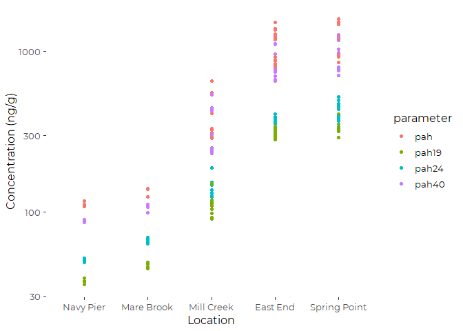
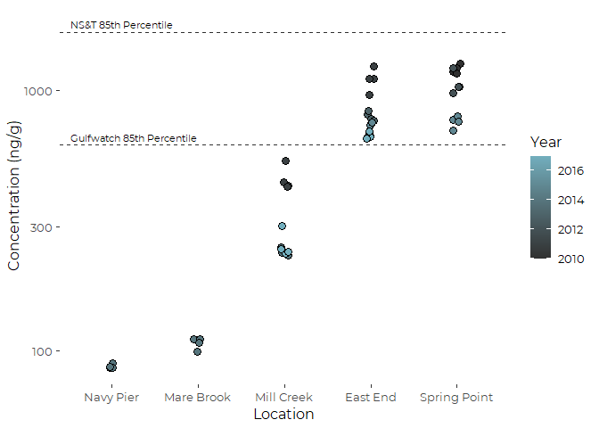
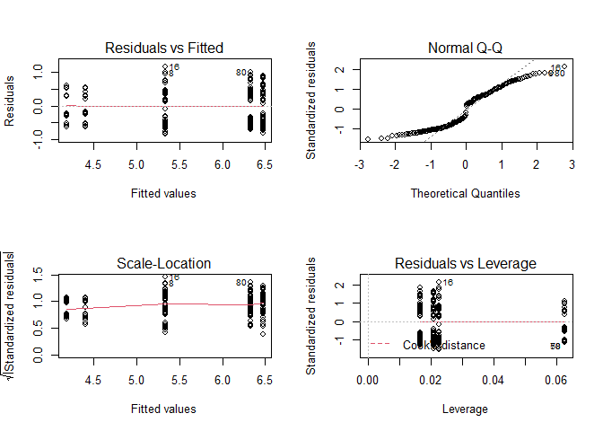
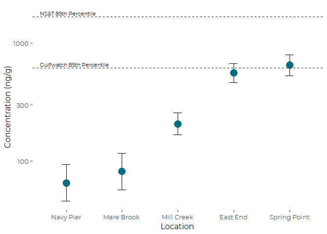
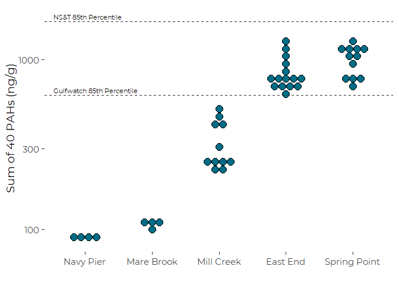
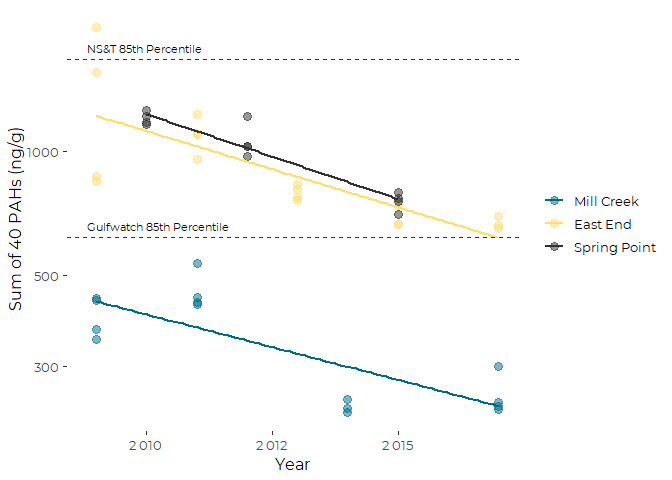
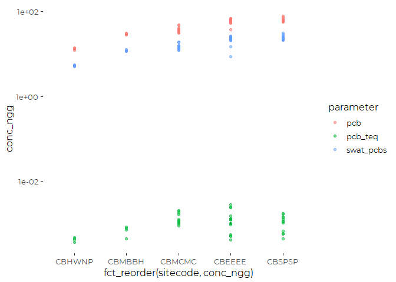
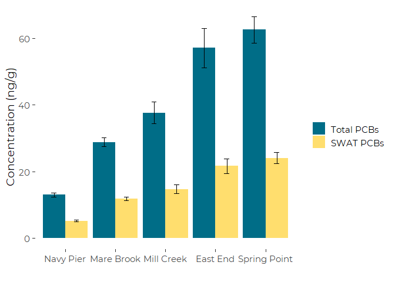
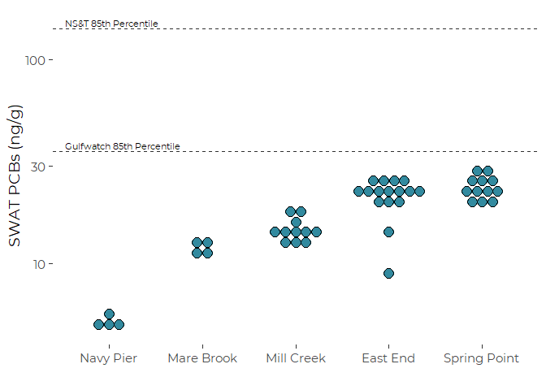
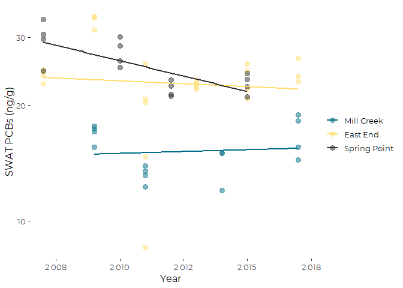

Analysis of Organic COntaminant Totals from EGAD Mussel Toxics Data
================
Curtis C. Bohlen, Casco Bay Estuary Partnership
11/02/2020

-   [Introduction](#introduction)
-   [Load Libraries](#load-libraries)
-   [Load Data](#load-data)
    -   [Establish Folder Reference](#establish-folder-reference)
    -   [Copy Data](#copy-data)
    -   [Load Reference Values](#load-reference-values)
    -   [Load Location Information](#load-location-information)
-   [Functions to add Reference
    Annotations](#functions-to-add-reference-annotations)
    -   [Utilities to Extract Axis
        Ranges](#utilities-to-extract-axis-ranges)
-   [Cross Tab to Look at Sample
    Distributions](#cross-tab-to-look-at-sample-distributions)
-   [PAHs](#pahs)
    -   [Data since 2010](#data-since-2010)
    -   [Which PAH Totals to use?](#which-pah-totals-to-use)
-   [Trend Site Analyses](#trend-site-analyses)
    -   [PAH-40 Graphic](#pah-40-graphic)
    -   [PAH-40 linear models](#pah-40-linear-models)
    -   [PCBs](#pcbs)
    -   [PCB Trends](#pcb-trends)


# Introduction

Maine’s Department of Environmental Protection (DEP) maintains a large
database of environmental data called “EGAD”. Citizens can request data
from the database through DEP staff.

CBEP requested data from DEP on levels of toxic contaminants in
shellfish tissue samples from Casco Bay. The result is a large (&gt;
100,000 line) excel spreadsheet containing data from about 40 sampling
dates from 20 locations, over a period of more than 15 years.

In this Notebook, we analyze organic contaminants found in blue mussel
(*Mytilus edulis*) tissue. To simplify presentation of levels of organic
contaminants, we focus here on various sums of organic contaminants that
can be related more readily to reference levels.

We focus on the following analytic totals:

-   Total PAHs  
-   Total PCBs  
-   “SWAT PCBs”  
-   Total Dioxins  
-   Total DDT Residues

# Load Libraries

``` r
library(tidyverse)
```

    ## -- Attaching packages --------------------------------------- tidyverse 1.3.1 --

    ## v ggplot2 3.3.5     v purrr   0.3.4
    ## v tibble  3.1.6     v dplyr   1.0.7
    ## v tidyr   1.1.4     v stringr 1.4.0
    ## v readr   2.1.1     v forcats 0.5.1

    ## -- Conflicts ------------------------------------------ tidyverse_conflicts() --
    ## x dplyr::filter() masks stats::filter()
    ## x dplyr::lag()    masks stats::lag()

``` r
library(readxl)
library(htmltools)  # used by knitr. Called here only to avoid startup text
library(knitr)

library(mblm)
library(emmeans)

library(CBEPgraphics)
load_cbep_fonts()
theme_set(theme_cbep())

library(LCensMeans)
```

# Load Data

## Establish Folder Reference

``` r
sibfldnm <- 'Data'
parent   <- dirname(getwd())
sibling  <- file.path(parent,sibfldnm)
fn <- 'SWAT_totals_working.csv'
```

## Copy Data

This is a larger data file that takes some time to load. Getting the
column types right dramatically improves load speed. Much of the data is
qualitative, and can’t be handled in R, so we delete it.

To save on keystrokes, we also clean up the parameter names.

``` r
swat_totals <- read_csv(file.path(sibling, fn),
                        col_type = cols(
                          .default = col_character(),
                          site_seq = col_double(),
                          year = col_integer(),
                          sample_date = col_date(format = ""),
                          concentration = col_double(),
                          lab_qualifier = col_logical(),
                          dilution_factor = col_double(),
                          conc_ugg = col_double(),
                          conc_ngg = col_double(),
                          rl_ugg = col_skip(),
                          rl_ngg = col_skip()
                        )) %>%
  select(-site_seq, -lab, -method, -method_name,
         -prep_method, -dilution_factor, -cas_no) %>%

  mutate(parameter = sub('-H', '', parameter)) %>%
  mutate(parameter = sub(' \\(ND=1/2 DL\\)', '', parameter)) %>%
  mutate(parameter = sub('TOTAL ', '', parameter)) %>%
  mutate(parameter = tolower(parameter)) %>%
  mutate(parameter = sub(' ', '_', parameter))
```

``` r
unique(swat_totals$parameter)
```

    ##  [1] "pah19"        "pesticides21" "pcb_teq"      "pcb"          "pah"         
    ##  [6] "pah24"        "pah40"        "dx_teq"       "swat_pcbs"    "dioxins"     
    ## [11] "total_ddt"

## Load Reference Values

There is no good way to establish toxicity benchmarks for edible tissue.
Maine DEP instead compares values of analytic totals to prevalence
benchmarks (medians and 85th percentiles) derived from the Gulfwatch and
National Status And trends monitoring programs, as published by Leblanc
et al. 2009.

> Leblanc, L.A., Krahforst, C.F., Aubé, J., Roach, S., Brun, G.,
> Harding, G., Hennigar, P., Page, D., Jones, S., Shaw, S., Stahlnecker,
> J., Schwartz, J., Taylor, D., Thorpe, B., & Wells, P. (2009).
> Eighteenth Year of the Gulf of Maine Environmental Monitoring Program.

We copied benchmark tables from (an on-line version of) Leblanc et
al. 2009 into our excel spreadsheet, and read those benchmarks in here.

``` r
references <- read_excel(file.path(sibling,"Parameter List.xlsx"), 
                             sheet = "Organic Comparisons",
                         range = 'a3:f8') %>%
  rename('Reference_ngg' = ...1) %>%
  filter(! is.na(Reference_ngg)) %>%
  mutate(Reference_ngg = sub(' 2008', '', Reference_ngg))
```

    ## New names:
    ## * `` -> ...1

## Load Location Information

And add a short location name for figures.

``` r
locations <- read_csv(file.path(sibling,"sites_spatial.csv"), 
    col_types = cols(SITESEQ = col_skip(), 
        LAT = col_skip(), LONG = col_skip())) %>%
  filter (! is.na(SITE)) %>%  # drops unnamed sites

  mutate(short_locs= c("Back Bay",
                      "Outer Fore River",
                      "Cocktail Cove",
                      "SW Great Diamond",
                      "Navy Pier",
                      "Mill Creek",
                      "Royal River",
                      "Haraseeket",
                      "Falmouth",
                      "Mare Brook",
                      "Fore River",
                      "East End",
                      "Spring Point",
                      "Jewel Island",
                      "Presumpscot",
                      "Middle Bay",
                      "Maquoit Bay",
                      "Inner Fore",
                      "Quahog Bay",
                      "Long Island"))

swat_totals <- swat_totals %>%
  mutate(short_locs = locations$short_locs[match(sitecode,
                                                 locations$SITECODE)]) %>%
  mutate(short_locs = factor(short_locs,
                             levels = c('Navy Pier', 'Mare Brook', 'Mill Creek',
                                        'East End', 'Spring Point')))
#rm(locations)
```

# Functions to add Reference Annotations

By isolating the code for adding annotations, we can redesign the
annotations once, and have it percolate through all graphics.

## Utilities to Extract Axis Ranges

These functions do not yet properly account for multiple plots due to
faceting.

``` r
get_xrange <- function(p) {
  ggp <- ggplot_build(p)
  return(ggp$layout$panel_params[[1]]$x.range)
}
  
get_yrange <- function(p) {
  ggp <- ggplot_build(p)
  return(ggp$layout$panel_params[[1]]$y.range)
}
```

The following code positions annotations at 2.5% of the x range from the
left edge. That positioning could be relegated to a parameter.

``` r
add_refs <- function(plt, parm = 'PAH40', whch = c(1:4), sz = 3) {
  plt2 <- plt
  # Extract x range and calculate annotation position
  xrng <- get_xrange(plt2)
  xpos <- xrng[1] + 0.025*(xrng[2]-xrng[1])
  
  # Draw the Reference Lines
  for (refline in (1:4)) {
      if (refline %in% whch){
        plt2 <- plt2 + 
        geom_hline(yintercept = references[[parm]][refline],
                   color = cbep_colors2()[1],
                   lwd = 0.5, lty = 2)
      }
  }
  
  # Draw the Associated Text Annotations
  labs = references[whch,]
  plt2 <- plt2 + 
  geom_text(data = labs,
            aes(x = xpos, y = .data[[parm]], label = Reference_ngg),
            hjust = 0,
            size = sz,
            nudge_y = .03)
      
  return(plt2)
  }
```

# Cross Tab to Look at Sample Distributions

``` r
xtabs(~ sitecode + year , data = swat_totals,
      subset = parameter == 'pah19')
```

    ##         year
    ## sitecode 2007 2008 2009 2010 2011 2012 2013 2014 2015 2017
    ##   CBANAN    4    0    0    0    0    0    0    0    0    0
    ##   CBEEEE    5    0    4    0    4    0    4    0    4    3
    ##   CBFRIR    0    0    4    0    0    0    0    0    0    0
    ##   CBFRMR    4    0    0    0    0    0    0    0    0    0
    ##   CBHRHR    4    0    0    0    0    0    0    0    0    0
    ##   CBHWNP    0    0    0    0    0    0    0    4    0    0
    ##   CBJWPB    4    0    0    0    0    0    0    0    0    0
    ##   CBLNFT    0    0    4    0    0    0    0    0    0    0
    ##   CBMBBH    4    0    0    0    0    0    0    4    0    0
    ##   CBMBBR    0    0    4    0    0    0    0    0    0    0
    ##   CBMBMB    0    4    0    0    0    0    0    0    0    0
    ##   CBMCMC    0    0    4    0    4    0    0    3    0    4
    ##   CBPRMT    0    4    0    0    0    0    0    0    0    0
    ##   CBQHQH    0    0    4    0    0    0    0    0    0    0
    ##   CBSPSP    4    0    0    4    0    4    0    0    4    0

We have few sites with good temporal coverage. Most sites were only
sampled once. The high frequency sites (three or more sample years)
include: \* CBEEEE – \* CBMCMC \* CBSPSP

In addition, CBMBBH was sampled twice. Other sites were each sampled
only once, making them problematic for trend analysis, since sites are
NOT random samples drawn from a well defined population of sites.

We have only two years, and three sites (our three high frequency sites)
sampled since our last State of the Bay report, to offer a recent
“status” update. If we extend to the last ten years, we only pick up
only two more, both sampled in 2014.

Certain years, notably 2007 and 2009 have relatively dense spatial
coverage, however, 2007 lacks some categories of data or diagnostic
totals.

``` r
xtabs(~ parameter + year , data = swat_totals)
```

    ##               year
    ## parameter      2007 2008 2009 2010 2011 2012 2013 2014 2015 2017
    ##   dioxins         0    4    0    0    0    0    0    0    0    0
    ##   dx_teq          0    4    0    0    0    0    0    0    0    0
    ##   pah             0    0   24    4    8    4    4   11    8    7
    ##   pah19          29    8   24    4    8    4    4   11    8    7
    ##   pah24           0    0   24    4    8    4    4   11    8    7
    ##   pah40           0    0   24    4    8    4    4   11    8    7
    ##   pcb            28    8   24    4    9    4    4   11    8    7
    ##   pcb_teq        28    8   23    4    8    4    4   11    8    7
    ##   pesticides21   38   12   24    4    8    4    0    0    0    0
    ##   swat_pcbs      28    8   24    4    9    4    4   11    8    7
    ##   total_ddt      28    8   24    4    8    4    0    0    0    0

So, we have dioxin data ONLY from 2008, and pesticides data no more
recently than 2012. That makes both problematic for trend analysis, and
both too old for a current “status” update.

The core of this analysis therefore will be on PAHs and PCBs.

# PAHs

## Data since 2010

Recent data can be summarized with more complete totals – the PAH 40 is
available for the entire period.

Give the paucity of data and sites from 2015 through 2019, we consider
“recent” data to include the last 10 years, or 2010 through 2019.

``` r
pah_data <- swat_totals %>%
  filter(grepl('pah', parameter))

pah_recent_data <- pah_data %>%
  filter(year >= 2010)
```

## Which PAH Totals to use?

``` r
plt <- ggplot(pah_recent_data,
              aes(fct_reorder(short_locs, conc_ngg), conc_ngg)) +
  geom_point(aes(color = parameter)) +
  scale_y_log10() +
  theme_cbep(base_size = 12) +
  ylab("Concentration (ng/g)") +
  xlab('Location')
plt
```

<!-- -->
So, rank order of sites is fairly consistent. PAH 19 is a fraction of
Total PAHs, but rank order is similar. PAH 40 appears pretty
consistently similar to total PAHs, something close to 80% of the larger
sum.

``` r
swat_totals %>%
  filter(parameter == 'pah40' | parameter == 'pah') %>%
  filter(year > 2009) %>%
  group_by(sitecode, year) %>%
  summarize(n_total = sum(parameter =='pah'),
            sum_total = sum((parameter =='pah') * concentration),
            mean_total = sum_total/n_total,
            n_40 = sum(parameter =='pah40'),
            sum_40 = sum((parameter =='pah40') * concentration),
            mean_40 = sum_40/n_40,
            ratio = mean_40 / mean_total, 
            .groups = 'drop') %>%
  select(-n_total, -sum_total, -n_40, -sum_40) %>%
  pull(ratio) %>%
  mean()
```

    ## [1] 0.7889976

``` r
pah_data %>%
  select(code, lab_id, parameter, conc_ngg) %>%
  pivot_wider(names_from = parameter, values_from = conc_ngg) %>%
  select(-code, -lab_id) %>%
  cor(use='pairwise')
```

    ##           pah19       pah     pah24     pah40
    ## pah19 1.0000000 0.9590664 0.9993970 0.9581496
    ## pah   0.9590664 1.0000000 0.9631325 0.9974265
    ## pah24 0.9993970 0.9631325 1.0000000 0.9613104
    ## pah40 0.9581496 0.9974265 0.9613104 1.0000000

What that shows is all these PAH values are highly correlated. The more
limited lists (pah19 and pah24) are closely correlated with each other.
PAH40 and total PAHs are also highly correlated.

### PAH 40

So, we focus on PAH 40, since it matches a published benchmark, and
approximates total PAHs fairly well. Our primary interest in the status
analysis is to compare observations to benchmarks. We do this
principally graphically.

#### Jittered Graphic

``` r
plt <- pah_recent_data %>%
  filter(parameter == 'pah40') %>%
  ggplot(aes(fct_reorder(short_locs, conc_ngg), conc_ngg)) +
  geom_jitter(mapping = aes(fill = as.integer(year)),
             size = 3,
             shape = 21,
             width = 0.05) +
  scale_fill_gradient(name = 'Year',
                        low = cbep_colors2()[1],
                        high = cbep_colors2()[4]) +
  scale_y_log10() +
  theme_cbep(base_size = 12)  +
  ylab('Concentration (ng/g)') +
  xlab('Location')
```

``` r
add_refs(plt, parm = 'PAH40', whch = c(2,4))
```

<!-- -->

#### Log Linear Model

Analternative approach is to explicitly model this as a log linear model
and extract expectations and confidence intervals from the model object,
using `emmeans`. This makes the results model dependent, but makes more
efficient use of the data (if the model is appropriate).

``` r
sites_lm <- lm(log(conc_ngg) ~ short_locs, data = pah_recent_data)
anova(sites_lm)
```

    ## Analysis of Variance Table
    ## 
    ## Response: log(conc_ngg)
    ##             Df  Sum Sq Mean Sq F value    Pr(>F)    
    ## short_locs   4 121.474 30.3685  101.44 < 2.2e-16 ***
    ## Residuals  179  53.587  0.2994                      
    ## ---
    ## Signif. codes:  0 '***' 0.001 '**' 0.01 '*' 0.05 '.' 0.1 ' ' 1

``` r
oldpar <- par(mfrow = c(2,2))
plot(sites_lm)
```

<!-- -->

``` r
par(oldpar)
```

That q-q plot is abysmal! The other model diagnostics are fine.
Untransformed models show marked scale-dependence of variability, which
is largely missing here. We’d be far better off with a model that better
fit the random component of these data.

``` r
emm <- emmeans(sites_lm, "short_locs", type = 'response')
(sm <- summary(emm, adjust = "sidak"))
```

    ##  short_locs   response    SE  df lower.CL upper.CL
    ##  Navy Pier        65.3  8.93 179     45.8     93.2
    ##  Mare Brook       81.7 11.18 179     57.3    116.5
    ##  Mill Creek      206.2 17.01 179    166.5    255.5
    ##  East End        559.0 39.48 179    465.3    671.5
    ##  Spring Point    649.9 51.33 179    529.4    797.8
    ## 
    ## Confidence level used: 0.95 
    ## Conf-level adjustment: sidak method for 5 estimates 
    ## Intervals are back-transformed from the log scale

``` r
plt <- sm %>% arrange(response) %>%
  ggplot(aes(x = fct_reorder(short_locs, response), y = response)) +
  geom_errorbar(aes(ymin = lower.CL, ymax = upper.CL),
                width = .15) +
  geom_point(color = cbep_colors()[1],
             size = 5) +
  
  scale_y_log10() +
  theme_cbep(base_size = 12)  +
  ylab('Concentration (ng/g)') +
  xlab('Location')
```

``` r
add_refs(plt, parm = 'PAH40', whch = c(2,4))
```

<!-- -->

That is simpler, but rests on a shaky modeling foundation, and may be
misleading. In particular, the error bars for the smaller means are
effectively “infected” with the high variability of the larger means.
Despite no variability to speak of at Navy Pier, we get significant
standard errors because variability is estimated based on all sites.

#### Dot Histogram

``` r
plt <- pah_recent_data %>%
  filter(parameter == 'pah40') %>%
  
  ggplot(aes(fct_reorder(short_locs, conc_ngg), conc_ngg)) +
 
  geom_dotplot(method = 'histodot',
               binaxis='y',
               stackdir='center',
               binpositions="all",
               fill = cbep_colors()[1]
               ) +
  
  scale_fill_gradient(name = 'Year',
                        low = cbep_colors2()[1],
                        high = cbep_colors2()[4]) +
  scale_y_log10() +
  theme_cbep(base_size = 14)  +
  ylab('Sum of 40 PAHs (ng/g)') +
  xlab('')
```

``` r
add_refs(plt, parm = 'PAH40', whch = c(2,4), sz = 3)
```

    ## Bin width defaults to 1/30 of the range of the data. Pick better value with `binwidth`.
    ## Bin width defaults to 1/30 of the range of the data. Pick better value with `binwidth`.

<!-- -->

# Trend Site Analyses

``` r
sites <- c('CBEEEE', 'CBMCMC', 'CBSPSP')
pah_trend_data <- swat_totals %>%
  filter(grepl('pah', parameter)) %>%
  filter(sitecode %in% sites)
```

## PAH-40 Graphic

``` r
plt <- pah_trend_data %>%
  filter(parameter == 'pah40') %>%
  
  ggplot(aes(year, conc_ngg)) +
  geom_point(aes(color = short_locs), size = 3, alpha = .5) +
  
  geom_smooth(aes(color = short_locs), method = 'lm', se = FALSE) +
  scale_y_log10() +
  
  theme_cbep(base_size = 12)  +
  theme(legend.title = element_blank()) +
  scale_color_manual(values = cbep_colors()) +
  scale_x_continuous(labels = scales::label_number(accuracy = 1)) +
  
  ylab('Sum of 40 PAHs (ng/g)') +
  xlab('Year')
```

``` r
add_refs(plt, parm = 'PAH40', whch = c(2,4))
```

    ## `geom_smooth()` using formula 'y ~ x'
    ## `geom_smooth()` using formula 'y ~ x'

<!-- -->

That is actually fairly remarkable, and suggests an ANCOVA would be
informative.

## PAH-40 linear models

We select an optimal model using AIC criteria.

``` r
full_pah40_lm <- lm(log(conc_ngg) ~ 0 + sitecode * year, data = pah_trend_data,
                    subset = parameter == 'pah40')
pah40_lm <- step(full_pah40_lm)
```

    ## Start:  AIC=-155.82
    ## log(conc_ngg) ~ 0 + sitecode * year
    ## 
    ##                 Df Sum of Sq    RSS     AIC
    ## - sitecode:year  2  0.020846 1.2185 -159.03
    ## <none>                       1.1977 -155.82
    ## 
    ## Step:  AIC=-159.03
    ## log(conc_ngg) ~ sitecode + year - 1
    ## 
    ##            Df Sum of Sq     RSS     AIC
    ## <none>                   1.2185 -159.03
    ## - year      1    2.2529  3.4714 -112.87
    ## - sitecode  3   13.1893 14.4079  -51.40

``` r
summary(pah40_lm)
```

    ## 
    ## Call:
    ## lm(formula = log(conc_ngg) ~ sitecode + year - 1, data = pah_trend_data, 
    ##     subset = parameter == "pah40")
    ## 
    ## Residuals:
    ##      Min       1Q   Median       3Q      Max 
    ## -0.35408 -0.09536 -0.00067  0.06893  0.51106 
    ## 
    ## Coefficients:
    ##                  Estimate Std. Error t value Pr(>|t|)    
    ## sitecodeCBEEEE 170.834196  18.616129   9.177 1.37e-11 ***
    ## sitecodeCBMCMC 169.839979  18.615004   9.124 1.61e-11 ***
    ## sitecodeCBSPSP 170.907224  18.611934   9.183 1.34e-11 ***
    ## year            -0.081503   0.009249  -8.812 4.25e-11 ***
    ## ---
    ## Signif. codes:  0 '***' 0.001 '**' 0.01 '*' 0.05 '.' 0.1 ' ' 1
    ## 
    ## Residual standard error: 0.1703 on 42 degrees of freedom
    ## Multiple R-squared:  0.9994, Adjusted R-squared:  0.9993 
    ## F-statistic: 1.683e+04 on 4 and 42 DF,  p-value: < 2.2e-16

That shows little or no difference in slopes, but a meaningful
difference in base levels.

-   Since this is a log regression, the slope is close to annual percent
    reduction, so concentration of these PAHs has dropped on average
    about 8% a year over the past decade or so.

-   The Mill Creek (CBMCMC) Samples are a factor of just under three
    (exp(1)) smaller that the other two sites.

## PCBs

``` r
pcb_data <- swat_totals %>%
  filter(grepl('pcb', parameter))

pcb_recent_data <- pcb_data %>%
  filter(year > 2009)

pcb_trend_data <- pcb_data %>%
  filter(! grepl('teq', parameter)) %>%
  filter(sitecode %in% sites)
```

### Preliminary Graphic

``` r
plt <- ggplot(pcb_recent_data, aes(fct_reorder(sitecode, conc_ngg), conc_ngg)) +
  geom_point(aes(color = parameter), alpha = 0.5) +
  scale_y_log10() +
  theme_cbep(base_size = 12)
plt
```

<!-- -->

SWAT PCBs are slightly smaller than Total PCBs. It makes little sense
that TEQs are so much lower. I wonder if these are in fact reported in
different units.  
They are reported as being in pg/g, as are the other PCB values but the
values are several orders of magnitude lower.

### Correlations

``` r
pcb_data %>%
  select(code, lab_id, parameter, conc_ngg) %>%
  pivot_wider(names_from = parameter, values_from = conc_ngg) %>%
  select(-code, -lab_id) %>%
  cor(use='pairwise')
```

    ##             pcb_teq       pcb swat_pcbs
    ## pcb_teq   1.0000000 0.7166296 0.7206949
    ## pcb       0.7166296 1.0000000 0.9992674
    ## swat_pcbs 0.7206949 0.9992674 1.0000000

So even though SWAT PCBs are based on a subset of all PCBs, the two
metrics are highly correlated. The TEQs are only moderately correlated
with the other two measures.

### Barchart COmparing PCB Measures

``` r
plt <- pcb_recent_data %>%
  filter(! parameter == 'pcb_teq') %>%
  select(short_locs, sample_id, conc_ngg, year, parameter) %>%
  group_by(short_locs, parameter) %>%
  summarize(val = mean(conc_ngg),
            std_dev = sd(conc_ngg, na.rm = TRUE),
            n = sum(! is.na(conc_ngg)),
            std_err = std_dev/sqrt(n),
           .groups = 'drop') %>%
  
  ggplot(aes(fct_reorder(short_locs, val), val, fill = parameter)) +
    scale_fill_manual(values = cbep_colors(),
                      labels = c('Total PCBs', 'SWAT PCBs'),
                      name = '', )  +
    geom_col(position = position_dodge()) +
    geom_errorbar(aes(ymin = val - 2 * std_err,
                  ymax = val + 2 * std_err), 
                  width = 0.2,
                  position = position_dodge(0.9)) +
  ylab("Concentration (ng/g)") +
  xlab('') +
  theme_cbep(base_size = 14)
plt
```

<!-- -->

#### Dot Histogram

We begin to focus on the SWAT PCB metric.

``` r
plt <- pcb_recent_data %>%
  filter(parameter == 'swat_pcbs') %>%
  
  ggplot(aes(fct_reorder(short_locs, conc_ngg), conc_ngg)) +
 
  geom_dotplot(method = 'histodot',
               binaxis='y',
               stackdir='center',
               binpositions="all",
               fill = cbep_colors()[5]
               ) +
  
  scale_fill_gradient(name = 'Year',
                        low = cbep_colors2()[1],
                        high = cbep_colors2()[4]) +
  scale_y_log10() +
  theme_cbep(base_size = 14)  +
  ylab('SWAT PCBs (ng/g)') +
  xlab('')

add_refs(plt, parm = 'PCB21', whch = c(2,4), sz = 3)
```

    ## Bin width defaults to 1/30 of the range of the data. Pick better value with `binwidth`.
    ## Bin width defaults to 1/30 of the range of the data. Pick better value with `binwidth`.

<!-- -->

## PCB Trends

``` r
sites <- c('CBEEEE', 'CBMCMC', 'CBSPSP')

plt <- pcb_trend_data %>%
  filter(parameter == 'swat_pcbs') %>%
  
  ggplot(aes(year, conc_ngg, color = short_locs)) +
  geom_point(size = 3, alpha = .5) +
  
  geom_smooth(method = 'lm', se = FALSE) +
  scale_y_log10() +
  
  theme_cbep(base_size = 12)  +
  theme(legend.title = element_blank()) +
  scale_color_manual(values = cbep_colors()) +
  scale_x_continuous(labels = scales::label_number(accuracy = 1)) +
  
  ylab('SWAT PCBs (ng/g)') +
  xlab('Year')
plt
```

    ## `geom_smooth()` using formula 'y ~ x'

<!-- -->

We select an optimal model using AIC criteria.

``` r
full_swat_pcbs_lm <- lm(log(conc_ngg) ~ 0 + sitecode * year, data = pcb_trend_data,
                    subset = parameter == 'swat_pcbs')
swat_pcb_lm <- step(full_swat_pcbs_lm)
```

    ## Start:  AIC=-163.3
    ## log(conc_ngg) ~ 0 + sitecode * year
    ## 
    ##                 Df Sum of Sq    RSS     AIC
    ## - sitecode:year  2    0.1301 2.2316 -164.06
    ## <none>                       2.1015 -163.30
    ## 
    ## Step:  AIC=-164.06
    ## log(conc_ngg) ~ sitecode + year - 1
    ## 
    ##            Df Sum of Sq    RSS     AIC
    ## - year      1   0.06994 2.3016 -164.39
    ## <none>                  2.2316 -164.06
    ## - sitecode  3   2.39984 4.6315 -130.63
    ## 
    ## Step:  AIC=-164.39
    ## log(conc_ngg) ~ sitecode - 1
    ## 
    ##            Df Sum of Sq    RSS     AIC
    ## <none>                    2.30 -164.39
    ## - sitecode  3    502.51 504.81  120.70

``` r
summary(swat_pcb_lm)
```

    ## 
    ## Call:
    ## lm(formula = log(conc_ngg) ~ sitecode - 1, data = pcb_trend_data, 
    ##     subset = parameter == "swat_pcbs")
    ## 
    ## Residuals:
    ##      Min       1Q   Median       3Q      Max 
    ## -0.98593 -0.09140 -0.00293  0.11817  0.40116 
    ## 
    ## Coefficients:
    ##                Estimate Std. Error t value Pr(>|t|)    
    ## sitecodeCBEEEE  3.12853    0.04430   70.63   <2e-16 ***
    ## sitecodeCBMCMC  2.71811    0.05485   49.55   <2e-16 ***
    ## sitecodeCBSPSP  3.22658    0.05311   60.75   <2e-16 ***
    ## ---
    ## Signif. codes:  0 '***' 0.001 '**' 0.01 '*' 0.05 '.' 0.1 ' ' 1
    ## 
    ## Residual standard error: 0.2124 on 51 degrees of freedom
    ## Multiple R-squared:  0.9954, Adjusted R-squared:  0.9952 
    ## F-statistic:  3712 on 3 and 51 DF,  p-value: < 2.2e-16

So, the best model by AIC suggests no long-term trend,and no significant
interactions, although the graphic suggests a possible interaction, as
concentrations at spring point appear to have been declining. However,
given variability in observations, that could be due to chance.
