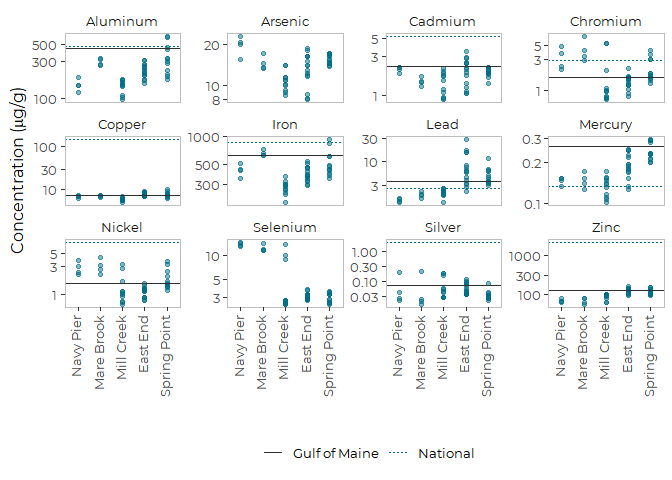

Analysis of Metal Contaminants from EGAD Mussel Toxics Data
================
Curtis C. Bohlen, Casco Bay Estuary Partnership
11/10/2020

-   [Introduction](#introduction)
    -   [Handling Non-Detects](#handling-non-detects)
-   [Load Libraries](#load-libraries)
-   [Utility Functions](#utility-functions)
    -   [Capitalise Strings](#capitalise-strings)
-   [Load Data](#load-data)
    -   [Establish Folder References](#establish-folder-references)
    -   [Copy Data](#copy-data)
    -   [Load Reference Values](#load-reference-values)
    -   [Load Location Information](#load-location-information)
-   [Data Since 2010](#data-since-2010)
    -   [Recents Graphic](#recents-graphic)


# Introduction

Maine’s Department of Environmental Protection (DEP) maintains a large
database of environmental data called “EGAD”. Citizens can request data
from the database through DEP staff.

CBEP requested data from DEP on levels of toxic contaminants in
shellfish tissue samples from Casco Bay. The result is a large (&gt;
100,000 line) excel spreadsheet containing data from about 40 sampling
dates from 20 locations, over a period of more than 15 years.

In this Notebook, we analyze metal contaminants found in blue mussel
(*Mytilus edulis*) tissue. Specifically, this notebook generates revised
graphics based on comments on our final draft State of Casco Bay
Chapter.

## Handling Non-Detects

Here, we replace non-detects with one half of the Reporting Limit.

For metals in these samples, non-detects are relatively rare, and
detection limits are well below observed levels, so choice of the
non-detect convention should have little effect on the qualitative
results.

# Load Libraries

``` r
library(tidyverse)
```

    ## Warning: package 'tidyverse' was built under R version 4.0.5

    ## -- Attaching packages --------------------------------------- tidyverse 1.3.1 --

    ## v ggplot2 3.3.5     v purrr   0.3.4
    ## v tibble  3.1.4     v dplyr   1.0.7
    ## v tidyr   1.1.3     v stringr 1.4.0
    ## v readr   2.0.1     v forcats 0.5.1

    ## Warning: package 'ggplot2' was built under R version 4.0.5

    ## Warning: package 'tibble' was built under R version 4.0.5

    ## Warning: package 'tidyr' was built under R version 4.0.5

    ## Warning: package 'readr' was built under R version 4.0.5

    ## Warning: package 'dplyr' was built under R version 4.0.5

    ## Warning: package 'forcats' was built under R version 4.0.5

    ## -- Conflicts ------------------------------------------ tidyverse_conflicts() --
    ## x dplyr::filter() masks stats::filter()
    ## x dplyr::lag()    masks stats::lag()

``` r
library(readxl)

library(CBEPgraphics)
load_cbep_fonts()
theme_set(theme_cbep())

library(LCensMeans)
```

# Utility Functions

## Capitalise Strings

`This`convert\_caps()\` splits a string, capitalizes the first character
and uncaps the rest. FOr one word strings, this corresponds to “title
case”.

``` r
simpleCap <- function(x) {
  s <- strsplit(x, " ")[[1]]
  paste(toupper(substring(s, 1,1)), tolower(substring(s, 2)),
      sep="", collapse=" ")
}

convert_caps <- function(x_vec) {
  as_vector(lapply(x_vec, simpleCap))
}
```

# Load Data

## Establish Folder References

``` r
sibfldnm <- 'Derived_Data'
parent   <- dirname(getwd())
sibling  <- file.path(parent,sibfldnm)
fn <- 'SWAT_metals_working.csv'

dir.create(file.path(getwd(), 'figures'), showWarnings = FALSE)
```

## Copy Data

Getting the column types right improves load speed. Much of the data is
qualitative, and can’t be readily handled in R, so we delete it. To save
on keystrokes, we also clean up the parameter names.

``` r
swat_metals <- read_csv(file.path(sibling, fn),
                        col_types = cols(
                          .default = col_character(),
                          site_seq = col_double(),
                          year = col_double(),
                          sample_date = col_date(format = ""),
                          concentration = col_double(),
                          rl = col_double(),
                          mdl = col_double(),
                          dilution_factor = col_double(),
                          cas_no = col_double(),
                          conc_ugg = col_double(),
                          rl_ugg = col_double(),
                          flag = col_logical(),
                          conc_RL = col_double(),
                          conc_HALF = col_double(),
                          conc_ML = col_double()
                        )) %>%
  select(-site_seq, -lab, -method, -method_name,
         -prep_method, -dilution_factor, -cas_no) %>%
  mutate(parameter = convert_caps(parameter))
```

## Load Reference Values

There are few really good ways to establish toxicity benchmarks for
edible tissue. Maine DEP principally compares values of analytic totals
to prevalence benchmarks (medians and 85th percentiles) derived from the
Gulfwatch and National Status And trends monitoring programs, as
published by Leblanc et al. 2009.

> Leblanc, L.A., Krahforst, C.F., Aubé, J., Roach, S., Brun, G.,
> Harding, G., Hennigar, P., Page, D., Jones, S., Shaw, S., Stahlnecker,
> J., Schwartz, J., Taylor, D., Thorpe, B., & Wells, P. (2009).
> Eighteenth Year of the Gulf of Maine Environmental Monitoring Program.

We copied benchmark tables from (an on-line version of) Leblanc et
al. 2009 into our excel spreadsheet.

That document refers to “MCDC Fish Tissue Action Levels.” and FDA Action
Levels. After some digging, we found a document on the Maine CDC website
that corresponds to (most or all of) the FTALs reported by DEP.

**ALL HEALTH\_RELATED THRESHOLDS ARE EXPRESSED ON A WET WEIGHT BASIS**

> Maine Center for Disease Control. 2001. Bureau of Health Fish Tissue
> Action Levels.
> <https://www.maine.gov/dhhs/mecdc/environmental-health/eohp/fish/documents/action-levels-writeup.pdf>.
> Accessed 11/10/2020.

``` r
references <- read_excel(file.path(sibling,"Parameter List.xlsx"), 
                             sheet = "Metals Comparisons") %>%
  filter(! is.na(Reference_ugg)) %>%
  mutate(Reference_ugg = sub(' 2008', '', Reference_ugg))
```

We will use only two of the reference values:  
\* “NS&T 85th Percentile”  
\* “Gulfwatch 85th Percentile”

The Health-based metrics are valuable for comparison, but they are
expressed on a wet weight basis, and so can not be shown on one graph
with the other reference levels.

We add shorter names for graphics

``` r
references <- references %>%
  mutate(short_ref = case_when(
      Reference_ugg == 'NS&T 85th Percentile'       ~ 'National',
      Reference_ugg == 'Gulfwatch 85th Percentile'  ~ 'Gulf of Maine'
  ))
```

### Pivot Most Important References to Long Form

The long form annotation data allows us to add annotations to faceted
plots in a simple way. While we are at it, we create better names for
some reference thresholds.

``` r
ref_long <- references %>%
  filter(grepl('85', Reference_ugg)) %>%
  pivot_longer(cols = Silver:Zinc, names_to = 'parameter', values_to = 'value')
```

## Load Location Information

And add a short location names for figures.

``` r
locations <- read_csv(file.path(sibling,"sites_spatial.csv"), 
    col_types = cols(SITESEQ = col_skip(), 
        LAT = col_skip(), LONG = col_skip())) %>%

  mutate(short_locs= c("Back Bay",
                      "Outer Fore River",
                      "Cocktail Cove",
                      "SW Great Diamond",
                      "Navy Pier",
                      "Mill Creek",
                      "Royal River",
                      "Haraseeket",
                      "Falmouth",
                      "Mare Brook",
                      "Fore River",
                      "East End",
                      "Spring Point",
                      "Jewel Island",
                      "Presumpscot",
                      "Middle Bay",
                      "Maquoit Bay",
                      "Inner Fore",
                      "Quahog Bay",
                      "Long Island"))
  
swat_metals <- swat_metals %>%
  mutate(short_locs = locations$short_locs[match(sitecode,
                                                 locations$SITECODE)]) %>%
  mutate(short_locs = factor(short_locs,
                             levels = c('Navy Pier', 'Mare Brook', 'Mill Creek',
                                        'East End', 'Spring Point')))
rm(locations)
```

# Data Since 2010

Give the paucity of data and sited from 2015 through 2019, we consider
“recent” data to include the last 10 years, or 2010 through 2019.

``` r
recent_data <- swat_metals %>%
  filter(year >= 2010)
```

## Recents Graphic

``` r
plt <- ggplot(recent_data,
              aes(short_locs, conc_HALF)) +
  geom_point(color = cbep_colors()[1], alpha = 0.5) +
  
  scale_y_log10() +
  theme_cbep(base_size = 12) +
  theme(legend.title = element_blank()) +
  
  
  facet_wrap(~parameter, scale="free_y") +
  ylab(expression("Concentration (" *mu *"g/g)")) +
  xlab('') +
  theme(axis.text.x = element_text(angle = 90, vjust = 0.25, hjust = 1)) +
  theme(legend.position = 'bottom',
        panel.border = element_rect(color = 'gray', fill = NA, size = 0.25))
```

``` r
plt +
  geom_hline(mapping = aes(yintercept = value,
                 lty = short_ref, color = short_ref),
             data = ref_long ) +
 scale_color_manual(values = cbep_colors2())
```

    ## Warning: Removed 4 rows containing missing values (geom_hline).

<!-- -->

``` r
 ggsave('figures/metals_parameters_revised.pdf', device = cairo_pdf, width = 7, height = 5)
```

    ## Warning: Removed 4 rows containing missing values (geom_hline).
