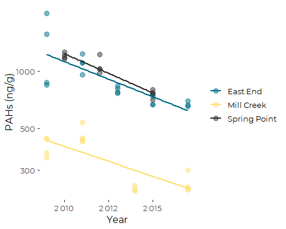
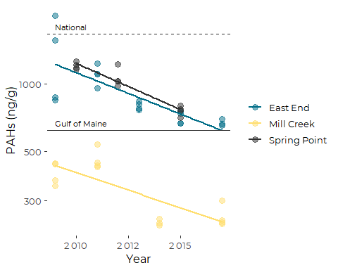
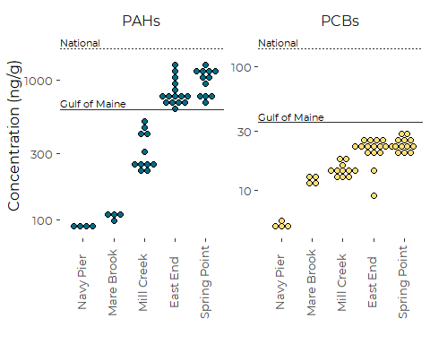

Graphics for Organic Contaminants from EGAD Mussel Toxics Data -
-REVISED
================
Curtis C. Bohlen, Casco Bay Estuary Partnership
11/10/2020

-   [Introduction](#introduction)
-   [Load Libraries](#load-libraries)
-   [Load Data](#load-data)
    -   [Establish Folder References](#establish-folder-references)
    -   [Copy Data](#copy-data)
    -   [Load Reference Values](#load-reference-values)
    -   [Load Location Information](#load-location-information)
-   [Functions to add Reference
    Annotations](#functions-to-add-reference-annotations)
    -   [Utilities to Extract Axis
        Ranges](#utilities-to-extract-axis-ranges)
    -   [Function for Adding
        Annotations](#function-for-adding-annotations)
-   [PAHs](#pahs)
    -   [Trend Graphic](#trend-graphic)
-   [PCBs](#pcbs)
    -   [Create Working Data](#create-working-data)
-   [Combined Graphic](#combined-graphic)
    -   [Create Combo Data](#create-combo-data)
    -   [Recent Conditions Dotplot](#recent-conditions-dotplot)
    -   [Add Annotations](#add-annotations)


# Introduction

Maine’s Department of Environmental Protection (DEP) maintains a large
database of environmental data called “EGAD”. Citizens can request data
from the database through DEP staff.

CBEP requested data from DEP on levels of toxic contaminants in
shellfish tissue samples from Casco Bay. The result is a large (&gt;
100,000 line) excel spreadsheet containing data from about 40 sampling
dates from 20 locations, over a period of more than 15 years.

In this Notebook, we revise final graphics in respose to commetns to our
final draft State of Casco Bay chapter.

We focus on the following analytic totals:

-   Total PAHs,
-   SWAT PCBs

Because they are readily compared to benchmarks.

For additional detail on statistical analysis and alternate graphics,
see the related “SWAT\_totals\_analysis.rmd” file in the “Analysis”
folder.

# Load Libraries

``` r
library(tidyverse)
```

    ## Warning: package 'tidyverse' was built under R version 4.0.5

    ## -- Attaching packages --------------------------------------- tidyverse 1.3.1 --

    ## v ggplot2 3.3.5     v purrr   0.3.4
    ## v tibble  3.1.4     v dplyr   1.0.7
    ## v tidyr   1.1.3     v stringr 1.4.0
    ## v readr   2.0.1     v forcats 0.5.1

    ## Warning: package 'ggplot2' was built under R version 4.0.5

    ## Warning: package 'tibble' was built under R version 4.0.5

    ## Warning: package 'tidyr' was built under R version 4.0.5

    ## Warning: package 'readr' was built under R version 4.0.5

    ## Warning: package 'dplyr' was built under R version 4.0.5

    ## Warning: package 'forcats' was built under R version 4.0.5

    ## -- Conflicts ------------------------------------------ tidyverse_conflicts() --
    ## x dplyr::filter() masks stats::filter()
    ## x dplyr::lag()    masks stats::lag()

``` r
library(readxl)

library(CBEPgraphics)
load_cbep_fonts()
theme_set(theme_cbep())

library(LCensMeans)
```

# Load Data

## Establish Folder References

``` r
sibfldnm <- 'Derived_Data'
parent   <- dirname(getwd())
sibling  <- file.path(parent,sibfldnm)
fn <- 'SWAT_totals_working.csv'

dir.create(file.path(getwd(), 'figures'), showWarnings = FALSE)
```

## Copy Data

This is a larger data file that takes some time to load. Getting the
column types right dramatically improves load speed. Much of the data is
qualitative, and can’t be handled in R, so we delete it.

To save on keystrokes, we also clean up the parameter names.

``` r
swat_totals <- read_csv(file.path(sibling, fn),
                        col_type = cols(
                          .default = col_character(),
                          site_seq = col_double(),
                          year = col_integer(),
                          sample_date = col_date(format = ""),
                          concentration = col_double(),
                          lab_qualifier = col_logical(),
                          dilution_factor = col_double(),
                          conc_ugg = col_double(),
                          conc_ngg = col_double(),
                          rl_ugg = col_skip(),
                          rl_ngg = col_skip()
                        )) %>%
  select(-site_seq, -lab, -method, -method_name,
         -prep_method, -dilution_factor, -cas_no) %>%

  mutate(parameter = sub('-H', '', parameter)) %>%
  mutate(parameter = sub(' \\(ND=1/2 DL\\)', '', parameter)) %>%
  mutate(parameter = sub('TOTAL ', '', parameter)) %>%
  mutate(parameter = tolower(parameter)) %>%
  mutate(parameter = sub(' ', '_', parameter))
```

``` r
unique(swat_totals$parameter)
```

    ##  [1] "pah19"        "pesticides21" "pcb_teq"      "pcb"          "pah"         
    ##  [6] "pah24"        "pah40"        "dx_teq"       "swat_pcbs"    "dioxins"     
    ## [11] "total_ddt"

## Load Reference Values

There is no good way to establish toxicity benchmarks for edible tissue.
Maine DEP instead compares values of analytic totals to prevalence
benchmarks (medians and 85th percentiles) derived from the Gulfwatch and
National Status And trends monitoring programs, as published by Leblanc
et al. 2009.

> Leblanc, L.A., Krahforst, C.F., Aubé, J., Roach, S., Brun, G.,
> Harding, G., Hennigar, P., Page, D., Jones, S., Shaw, S., Stahlnecker,
> J., Schwartz, J., Taylor, D., Thorpe, B., & Wells, P. (2009).
> Eighteenth Year of the Gulf of Maine Environmental Monitoring Program.

We copied benchmark tables from (an on-line version of) Leblanc et
al. 2009 into our excel spreadsheet, and read those benchmarks in here.

``` r
references <- read_excel(file.path(sibling,"Parameter List.xlsx"), 
                             sheet = "Organic Comparisons",
                         range = 'a3:f8') %>%
  rename('Reference_ngg' = ...1) %>%
  filter(! is.na(Reference_ngg)) %>%
  mutate(Reference_ngg = sub(' 2008', '', Reference_ngg))
```

    ## New names:
    ## * `` -> ...1

We add shorter names for graphics

``` r
references <- references %>%
  mutate(short_ref = case_when(
      Reference_ngg == 'NS&T 85th Percentile'       ~ 'National',
      Reference_ngg == 'Gulfwatch 85th Percentile'  ~ 'Gulf of Maine')) %>%
  mutate(alt_ref = factor(short_ref, 
                          levels = c('Gulf of Maine', 'National')))
```

## Load Location Information

And add a short location name for figures.

``` r
locations <- read_csv(file.path(sibling,"sites_spatial.csv"), 
    col_types = cols(SITESEQ = col_skip(), 
        LAT = col_skip(), LONG = col_skip())) %>%

  mutate(short_locs= c("Back Bay",
                      "Fore River",
                      "Cocktail Cove",
                      "SW Great Diamond",
                      "Navy Pier",
                      "Mill Creek",
                      "Royal River",
                      "Haraseeket",
                      "Falmouth",
                      "Mare Brook",
                      "Fore River",
                      "East End",
                      "Spring Point",
                      "Jewel Island",
                      "Presumpscot",
                      "Middle Bay",
                      "Maquoit Bay",
                      "Inner Fore",
                      "Quahog Bay",
                      "Long Island"))
```

### Add Short Location Names

Adding short location names.

``` r
swat_totals <- swat_totals %>%
  mutate(short_locs = locations$short_locs[match(sitecode, locations$SITECODE)])
```

# Functions to add Reference Annotations

By isolating the code for adding annotations, we can redesign the
annotations once, and have it percolate through all graphics.

## Utilities to Extract Axis Ranges

These functions do not properly account for multiple plots due to
faceting, but they work for simple plots. It is curious that the ranges,
which must be useful for modifying plots in many settings, are buried so
deeply in a complex data structure, and not exposed through the API.

``` r
get_xrange <- function(p) {
  ggp <- ggplot_build(p)
  return(ggp$layout$panel_params[[1]]$x.range)
}
  
get_yrange <- function(p) {
  ggp <- ggplot_build(p)
  return(ggp$layout$panel_params[[1]]$y.range)
}
```

## Function for Adding Annotations

The following function positions annotations at 2.5% of the x range from
the left edge. That positioning could be relegate to a parameter.

``` r
add_refs <- function(plt, parm = 'PAH40', whch = c(1:4), sz = 3) {
  plt2 <- plt
  # Extract x range and calculate annotation position
  xrng <- get_xrange(plt2)
  xpos <- xrng[1] + 0.025*(xrng[2]-xrng[1])
  
  # Draw the Reference Lines
  for (refline in (1:4)) {
      if (refline %in% whch){
        plt2 <- plt2 + 
        geom_hline(yintercept = references[[parm]][refline],
                   color = cbep_colors2()[1],
                   lwd = 0.5, lty = 2)
      }
  }
  
  # Draw the Associated Text Annotations
  labs = references[whch,]
  plt2 <- plt2 + 
  geom_text(data = labs,
            aes(x = xpos, y = .data[[parm]], label = short_ref),
            hjust = 0,
            size = sz,
            nudge_y = .03)
  
  return(plt2)
  }
```

# PAHs

We focus on PAH 40, since it matches a national and regional benchmark,
and approximates total PAHs fairly well. The sum is highly correlated
with total PAHs, and amounts to about 75 or 80 percent of the total. Our
primary interest here to compare observations to benchmarks. \#\# Create
working data

``` r
pah_data <- swat_totals %>%
  filter(grepl('pah', parameter))

pah_recent_data <- pah_data %>%
  filter(year >= 2010)

sites <- c('CBEEEE', 'CBMCMC', 'CBSPSP')
pah_trend_data <- swat_totals %>%
  filter(grepl('pah', parameter)) %>%
  filter(sitecode %in% sites)
```

## Trend Graphic

``` r
plt <- pah_trend_data %>%
  filter(parameter == 'pah40') %>%
  
  ggplot(aes(year, conc_ngg)) +
  geom_point(aes(color = short_locs), size = 3, alpha = .5) +
  
  geom_smooth(aes(color = short_locs),
              method = 'lm', 
              formula = y~x,
              se = FALSE) +
  scale_y_log10() +
  
  theme_cbep(base_size = 12)  +
  theme(legend.title = element_blank()) +
  scale_color_manual(values = cbep_colors()) +
  scale_x_continuous(labels = scales::label_number(accuracy = 1)) +
  
  ylab('PAHs (ng/g)') +
  xlab('Year')
plt
```

<!-- -->

``` r
plt +
  geom_hline(yintercept = 1674, lty = 2,
             color = cbep_colors2()[1],
             lwd = 0.5) +
  geom_hline(yintercept = 618, lty = 1,
             color = cbep_colors2()[1],
             lwd = 0.5) +
  
  annotate('text', x = 2009, y = 1800, label = 'National',
            hjust = 0,
            size = 3) +

  annotate('text', x = 2009, y = 670, label = 'Gulf of Maine',
            hjust = 0,
            size = 3)
```

<!-- -->

``` r
ggsave('figures/pah_40_trend_w_refs_revised.pdf', device = cairo_pdf, width = 5, height = 4)
```

# PCBs

## Create Working Data

``` r
pcb_data <- swat_totals %>%
  filter(grepl('pcb', parameter))

pcb_recent_data <- pcb_data %>%
  filter(year > 2009)

pcb_trend_data <- pcb_data %>%
  filter(! grepl('teq', parameter)) %>%
  filter(sitecode %in% sites)
```

# Combined Graphic

The following code reorganizes data frames into the long format needed
by ggplot to produce a faceted graphic. The facets will be based on the
parameter name, so parameter values must match across the data and
reference data frames.

We filter the references to only the 85th percentile values. Since we
are only showing the 85th percentile values, we can use shorter, more
informative labels. We try a couple of alternatives.

## Create Combo Data

``` r
combo_data <- pah_recent_data %>%
  bind_rows(pcb_recent_data) %>%
  filter(parameter %in% c('swat_pcbs', 'pah40'))%>%
  mutate(short_locs = factor(short_locs,
                             levels = c('Navy Pier', 'Mare Brook', 'Mill Creek',
                                        'East End', 'Spring Point')))

combo_refs <- references %>%
  select(Reference_ngg, PAH40, PCB21) %>%
  filter(grepl('85', Reference_ngg)) %>%
  mutate(short_ref = sub(' 85th Percentile', '', Reference_ngg)) %>%
  mutate(alt_ref = factor(short_ref,
                          levels = c('Gulfwatch', 'NS&T'),
                          labels = c('Gulf of Maine', 'National'))) %>%
  rename(pah40 = PAH40,
         swat_pcbs = PCB21) %>%
  pivot_longer(c(pah40, swat_pcbs),
               names_to = "parameter",
               values_to = "value")
```

## Recent Conditions Dotplot

``` r
# Establish named labels
  labs <- c('PAHs', 'PCBs')
  names(labs) <- c("pah40", "swat_pcbs")
  
plt <- combo_data %>%
  ggplot(aes(short_locs, conc_ngg)) +
 
  geom_dotplot(aes(fill = parameter), 
               method = 'histodot',
               binaxis='y',
               stackdir='center',
               binpositions="all") +
  
  facet_wrap(~parameter, ncol = 2,
             scales = 'free_y',
             labeller = labeller(parameter = labs)) +
  
  scale_fill_manual(values = cbep_colors(),
                    name = '',
                    labels = c('PAHs', 'PCBs')) +

  scale_y_log10() +
  theme_cbep(base_size = 12)  +
  theme(axis.text.x = element_text(angle = 90, vjust = 0.25),
        strip.text = element_text(size = 12),
        legend.position = 'none') +
  ylab('Concentration (ng/g)') +
  xlab('')
```

## Add Annotations

``` r
plt +
  geom_hline(data = combo_refs, 
             aes(yintercept = value, lty = alt_ref),
             color = cbep_colors2()[1],
             lwd = 0.5) +
  
  
  geom_text(data = combo_refs, 
            aes(x = 0.25, y = value, label = alt_ref),
            hjust = 0,
            size = 3,
            nudge_y = .05)
```

    ## Bin width defaults to 1/30 of the range of the data. Pick better value with `binwidth`.

<!-- -->

``` r
ggsave('figures/combo_recent_revised.pdf', device = cairo_pdf, width = 5, height = 4)  
```

    ## Bin width defaults to 1/30 of the range of the data. Pick better value with `binwidth`.
